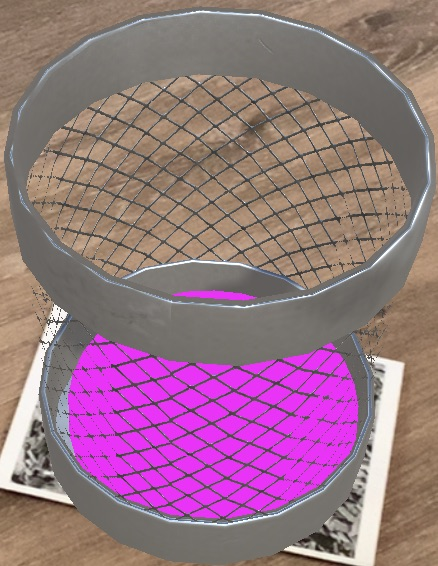

<h1>AR-Paper-Toss</h1>
This projects implements the mobile game ”Paper Toss” in augmented reality. Paper Toss AR is a mobile game developed with Unity that uses the Vuforia engine to provide an augmented reality experience. The goal of the game is to throw as many balls as possible into the trash can within a certain time. The trash can is located on a marker that is detected using the Vuforia engine. The game was developed for mobile devices and uses the camera for the augmented reality part and swipe and tap gestures to control the game. The developed game is strongly inspired by the existing mobile game ”Paper Toss”, which is developed by Backflip Studios for iOS and Android.
  
asd

  
  
  

